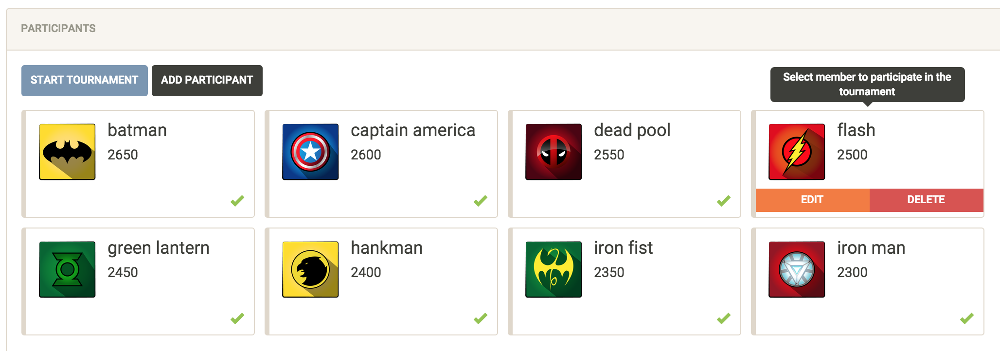
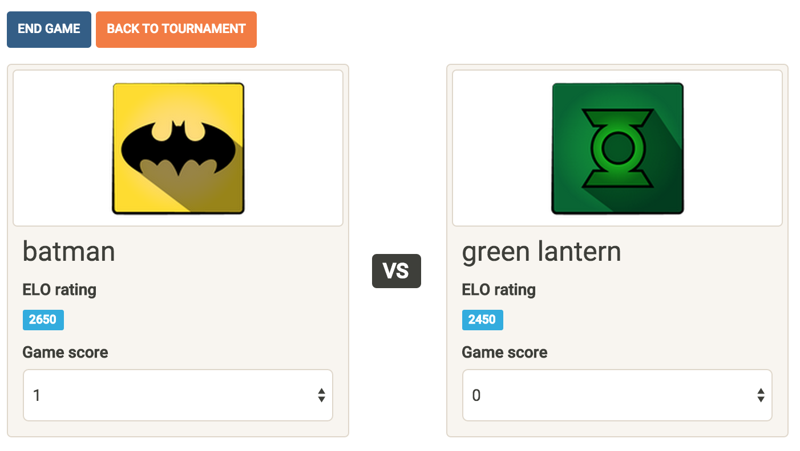
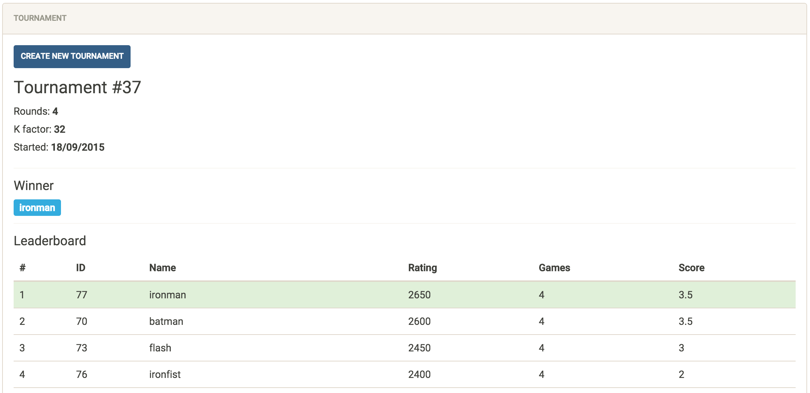

# chess-tournament
Swiss-system chess tournament SPA for judges to create contests and score participants

## Stack
*   AngularJS 1.4
*   Django REST framework 3.2
*   Django 1.8
*   Python 2.7
*   PostgreSQL 9.4

## Screenshots

#### Add/register members for participation in tournament

#### Score contestants during a game

#### Watch tournament progress and final results

